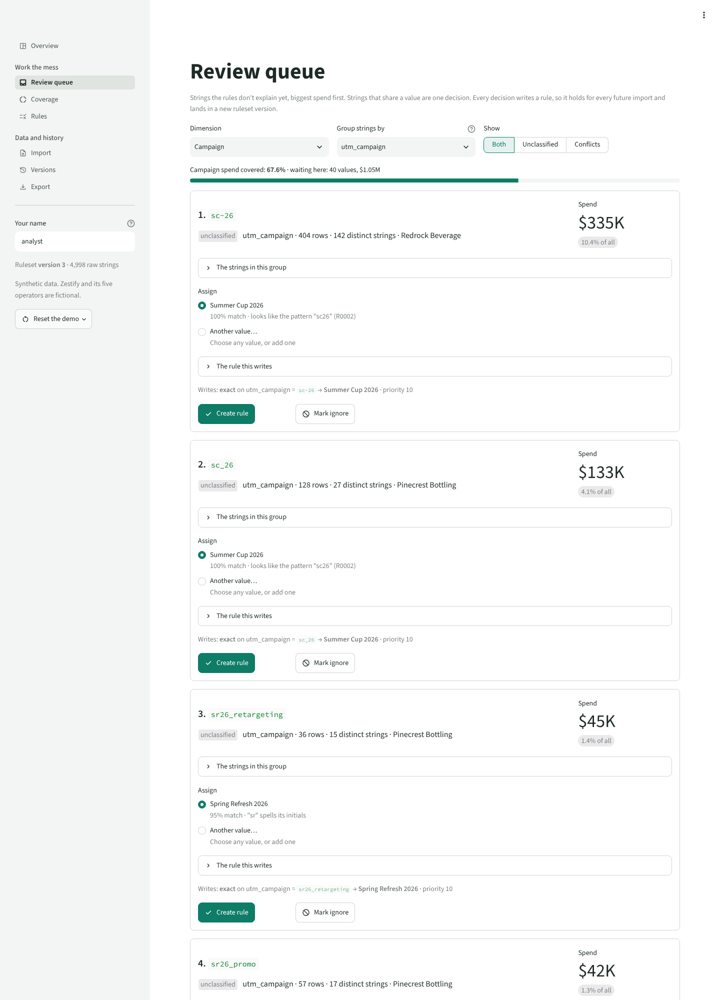
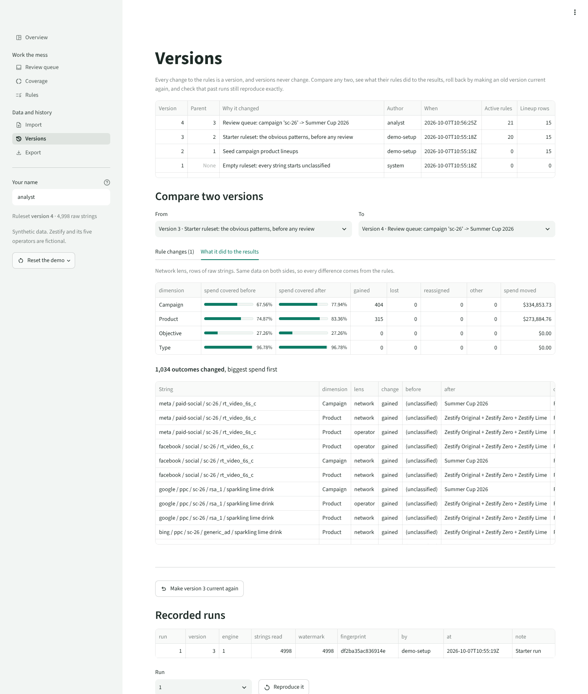

# Campaign Mapping Layer

A prototype that takes the messy UTM strings independent operators already send (`fb` vs `facebook` vs `FB_Paid`, `sc26` vs `summer-cup-26`), classifies them with a managed rule table, and reports how much of the data, and how much of the spend, the rules cover. Think of it as a chart of accounts for marketing campaigns, built after the fact from the mess people already have.

Every name in it is fictional: **Zestify** is an invented beverage brand, and its five operators (Northgate Beverage, Pinecrest Bottling, Harborline Distributing, Sunvale Drinks, Redrock Beverage) are invented bottlers. All data is synthetic.

**Status:** Stages 1–3 of 4 are built: the data model and engine, the synthetic data, and the Streamlit app. Stage 4 (evaluation against ground truth) is next. Not deployed yet; see [Deploying](#deploying-later).



## Success criteria

Defined before building, so the prototype can fail them.

| # | Criterion | How it is measured |
| --- | --- | --- |
| 1 | **Spend-weighted coverage above 90% after 30 minutes in the review queue** | Share of spend whose campaign is classified in the network lens, from the starter ruleset (built to land at roughly 60–70%) to the ruleset after one review session. "30 minutes" is taken as 40 review decisions at about 45 seconds each; the evaluation replays the queue top-down and reports coverage after each decision. Also reported per operator, and for type, product and objective. |
| 2 | **Zero silent conflicts** | When rules tie at the winning priority and disagree, the outcome is `conflict`: no value is assigned and every competing rule is stored for review. Unit tests cover it, `audit_result()` re-checks every run before it is stored (a run that breaks the promise is refused), and the conflict count is on the coverage report. |
| 3 | **Any past run is exactly reproducible from its ruleset version** | `reproduce_run()` re-classifies the run's input (every raw string up to its watermark) with its ruleset version and compares a SHA-256 fingerprint of the complete results with the one stored at the time. |
| 4 | **Measured precision and recall against ground truth, compared to a naive baseline** | Precision, recall and F1 per campaign (and for type), plus spend-weighted coverage, for three classifiers: the naive keyword filter (`contains "summer cup"`), the starter ruleset, and the ruleset after review. Ground truth is generated separately and never loaded into the app. |

## How it works

1. **Raw strings** are imported as they are and never changed. Each row has an operator, the five UTM fields, a date and its spend.
2. **Rules are data.** A rule says: on this dimension, if this field matches this pattern, assign this controlled value, at this priority. Rules live in a table, not in code.
3. **Every change to the rules is a new ruleset version**, and every classification run records the version it used. Last quarter's numbers can be rebuilt exactly, even after the rules have moved on.
4. **Coverage and the review queue** show what the rules don't explain yet, ranked by spend. Fixing a row means writing or accepting a rule, so the decision persists for every future import.

## Run it

Requires Python 3.11 or newer.

```bash
cd campaign-mapping
python3 -m venv .venv && . .venv/bin/activate
pip install -r requirements-dev.txt
streamlit run app/Home.py      # http://localhost:8501
python -m pytest               # every test, the app's pages included
```

The first start builds `data/demo.db` (about a second): the Zestify taxonomy, the 4,998 synthetic rows and the starter ruleset. **Reset the demo** in the sidebar rebuilds it. `python scripts/generate_data.py` regenerates the data files (the same bytes every time for the same seed), and `python -m campaign_mapping.demo` rebuilds the database from them.

## Layout

```
campaign-mapping/
├── campaign_mapping/      the package; nothing in it imports Streamlit
│   ├── schema.sql         the whole data model, with the triggers that guard it
│   ├── normalize.py       case and whitespace normalization         ┐
│   ├── matching.py        the four match types                      │ pure: no database
│   ├── models.py          the data passed in and out of the engine  │ or files, so they
│   ├── engine.py          classify, explain, preview, audit         │ can sit behind an
│   ├── diff.py            diff two rulesets, or two sets of results ┘ API later
│   ├── db.py              connection, schema, transactions
│   ├── taxonomy.py        operators, dimensions, values, campaigns
│   ├── rulesets.py        versioned rule changes, load or diff any version, revert
│   ├── runs.py            import raw strings, run and store, reproduce a run
│   ├── seed.py            the fictional Zestify network
│   ├── demo.py            build the demo database from data/
│   ├── reports.py         coverage, review queue and export tables (pandas)
│   └── suggest.py         review-queue suggestions (rapidfuzz)
├── app/                   the Streamlit app: Home.py and one file per page in views/
├── scripts/
│   └── generate_data.py   the synthetic data and its ground truth
├── data/
│   ├── utm_strings.csv    4,998 rows the app imports
│   ├── ground_truth.csv   the true campaign and type of every row; evaluation only, never imported
│   └── starter_rules.csv  the starter ruleset, as data
└── tests/
```

`tests/test_architecture.py` fails if any module imports Streamlit, or if a pure module imports the database layer, so the engine stays reusable.

## Data model

```
 TAXONOMY (controlled vocabulary)               INPUTS (append-only)
 workspaces ──────────────┐                     import_batches 1──* raw_strings
   (one per operator)     │                                           │ *
 dimensions 1──* dimension_values 1──1 campaigns          workspace ──┘
   campaign · product ·       │          (dates, operator)
   objective · type           │               │
                              │               │
 RULESET (immutable rows; a version is a manifest of exact rows)
 rules ── value_id ───────────┘               │
   rule_key + revision, dimension, field,     │
   match_type, pattern, action, priority,     │
   workspace (operator scope), owner, active  │
 campaign_products ── campaign_id ────────────┘
   the bridge: campaign → products, weighted, per lens
 ruleset_versions 1──* ruleset_version_rules *──1 rules
                  1──* ruleset_version_campaign_products *──1 campaign_products

 RESULTS (derived: rebuildable from version + watermark)
 classification_runs        version, engine version, input watermark, fingerprints
   1──* classifications     one per string × dimension × lens: status, method
          1──* classification_hits   value, the rule (or lineup row) that fired, spend share
```

| Table | What it holds |
| --- | --- |
| `raw_strings` | One row per imported row, exactly as it arrived: operator, the five UTM fields, date, spend, sends, and a hash for spotting duplicates. |
| `dimensions` | The four seeded dimensions. `layer` is `network` (a shared fact; only network rules may set it) or `workspace` (operators may add their own rules, seen only in their lens). `multi_valued` lets product hold several values. |
| `dimension_values` | The controlled values each dimension allows. Anyone can add one; none is ever renamed or deleted. |
| `campaigns` | Facts about a campaign value: start and end dates, and the operator for a local campaign (blank for network-wide ones). |
| `campaign_products` | The bridge from a campaign to the products its spend goes to, with relative weights. A blank operator is the network lineup; an operator's own lineup replaces it in that operator's lens. |
| `rules` | One immutable revision of a rule. `rule_key` ties a rule's revisions together; `id` is the exact revision a classification says fired. |
| `ruleset_versions` + manifests | A version and the exact rule revisions and lineup rows it contains, with its parent, author and message. |
| `classification_runs` | A run's ruleset version, engine version, input watermark and fingerprints. |
| `classifications` + `classification_hits` | One outcome per string, dimension and lens (`classified`, `conflict`, `unclassified` or `ignored`), and the rules behind it. The view `v_classifications` joins them back into "raw string, dimension, value, fired rule, version". |

## How a string is classified

For each string, dimension and lens:

1. **Normalize.** The string and every pattern go through the same function: Unicode compatibility form, zero-width characters removed, URL-encoded spaces (`%20`, `+`) turned into spaces, lowercase, runs of whitespace collapsed, ends trimmed. Separators like `-` and `_` are left alone on purpose; treating `summer-cup` and `summer_cup` as one string is a classification decision, and decisions belong in rules where they can be seen and versioned.
2. **Match.** Each active rule the lens can see tests the field it names (`source`, `medium`, `campaign`, `content`, `term`, or `any` for all five joined with ` | `) with its match type: `contains`, `exact`, `starts_with`, or `regex` (a search anywhere in the text, case-insensitive; anchor with `^` and `$` to match whole values). Regex patterns are compiled as written, never lowercased, since lowercasing would turn `\D` (not a digit) into `\d` (a digit). A regex that would match anything is rejected as a catch-all.
3. **Precedence.** The lowest priority number among the matching rules wins. If the winning tier disagrees, with two different values on a single-valued dimension or an ignore against an assign, the outcome is a **conflict**: nothing is assigned and every side is kept for review. Rules that tie on the same value are not a conflict; the value stands and every one of those rules is recorded. On a multi-valued dimension (product), every value in the winning tier is assigned.
4. **Default.** If nothing matches, the outcome is **unclassified**. There is no fallback value. Explicit values such as `Non-campaign` or `Not applicable` exist for when a rule knows a string has no campaign; that is a decision, which is different from not knowing.
5. **Product lineups.** When no product rule matches, the string inherits its campaign's lineup from `campaign_products`, split by weight. The operator's own lineup, if it has one, applies in its lens.

**Lenses.** The network lens sees only network rules and lineups; it is what every network roll-up uses. An operator's lens adds that operator's own product rules and lineups and never affects another operator or the network.

**Spend shares.** Each fired hit carries a share of the string's spend (weights add up to 1 per outcome), so a roll-up by product never counts a multi-product string twice.

**Priority conventions.** 10 for exact overrides from the review queue, 50 for specific patterns, 100 (the default) for general patterns, 200 for broad ones.

**Versions.** A rule is never edited in place: an edit writes a new revision and a new version that points to it. Grouped changes (`change_ruleset()`) become one version; a change that changes nothing makes none; a revert is a new version whose contents match an old one. A run stores its version, the engine version and an input watermark, the highest raw string id it read. Raw strings are append-only, so "every id up to the watermark" names the same rows forever, and re-running the version over them must reproduce the stored fingerprint.

## Stages

1. **Data model and engine** (done): schema, engine, versioning, diffs, reproducibility, tests.
2. **Synthetic data generator** (done): see [The synthetic data](#the-synthetic-data).
3. **Streamlit app** (done): see [The app](#the-app).
4. **Evaluation** (next): precision, recall and F1 per campaign against ground truth, spend-weighted coverage, and the naive baseline, with the results written up here.

## The synthetic data

`scripts/generate_data.py` writes 4,998 rows (2,067 distinct strings as written, $3.2M of spend), one per placement per week for the weeks of 5 January to 28 September 2026, seeded and byte-for-byte reproducible. Each operator has its own habits, the way real teams do: a few campaign spellings it keeps reusing, and its own names for sources and mediums.

| Operator | Habits |
| --- | --- |
| Northgate Beverage | SHOUTING_SNAKE_CASE, `FB` / `fb_paid` / `FACEBOOK`, brand prefixes (`ZST-SummerCup`), house abbreviations (`SC26_Launch`) |
| Pinecrest Bottling | Abbreviations everywhere (`sc_26`, `fk26`, `sr26_promo`), `paidsocial`, terse notices (`ord_conf`, `rte_chg_notice`) |
| Harborline Distributing | Title Case with spaces, URL-encoded spaces (`Spring+Refresh%202026`), typos (`witer_warmup`, `fal kickoff`) |
| Sunvale Drinks | Mostly email and SMS, `_newsletter` / `_blast` suffixes, and the most operational and transactional sends (receipts, reminders, holiday hours) |
| Redrock Beverage | kebab-case (`sc-26`, `summer-cup-26`), CamelCase, `meta` / `facebook` / `fb` |

A paid-media row is typically $200 to $2,100 for its week (up to about $7,800); email and SMS rows carry their send volume and a cost per send, so receipts and reminders are many rows but little spend. A few placements name two campaigns at once (`SUMMER_CUP_TO_FALL_KICKOFF_BRIDGE`), and some rows arrive twice, the way a double export does. `data/ground_truth.csv` holds each row's true campaign and type, joined on `row_id`; nothing in the app reads it.

**The starter ruleset** (`data/starter_rules.csv`, 20 rules) is what a network team writes first: the obvious spellings of each campaign, the flagship's house abbreviation, receipts and confirmations. It covers **67.6% of spend** on campaign, and where it fires it is right 99.9% of the time by spend. What it misses is the long tail: other abbreviations, typos, the two local campaigns and most operational notices: 40 values waiting in the review queue, two of them conflicts (5 rows).

## The app

| Page | What it does |
| --- | --- |
| **Overview** | Spend and row coverage against the 90% target, coverage by dimension, the biggest gaps. |
| **Review queue** | Unclassified and conflicted strings grouped by one field's value, biggest spend first. Each shows its suggestions (fuzzy matches against classified strings, rule patterns and value names, plus initials: `sr` spells **S**pring **R**efresh) with a score and the reason, a preview of the rule it will write and how much it reaches, and three actions: accept a suggestion, assign any value (or add a new one), or mark ignore. Every action writes a rule (exact match, priority 10 by default, all of it adjustable), so the decision is versioned and holds for every future import. |
| **Coverage** | Percent of rows and of spend classified per dimension and per operator, through the network lens or each operator's own; the top 20 unrecognized strings by spend; every conflict with its tied rules; and **Record run**, which stores the run with its fingerprint. |
| **Rules** | The current ruleset in a table where priority, owner and active can be edited in place (all edits save as one version); forms to add and edit a rule with a live **test this rule** panel (rows, distinct strings, spend and not-yet-classified spend it would reach, and the strings themselves); and each campaign's product lineup per lens. |
| **Import** | Upload CSV or Excel, map columns (guessed from their names), and check before loading: rows, distinct strings, spend, duplicate rows within the file, and rows already loaded (skipped by default, so spend is never counted twice). Every load is a numbered batch. |
| **Versions** | Every version with its author and reason; any two compared rule by rule and lineup by lineup; what that did to the results (coverage before and after, outcomes gained, lost and reassigned, the spend that moved, every changed string); revert as a new version; and **Reproduce** for any recorded run. |
| **Export** | The mapping table (each raw string with every dimension's value and the rule that set it) as CSV and Excel, and a roll-up by campaign with dates and product lineup. Every file names its ruleset version (`campaign_mapping_v7.xlsx`), and the workbook's About sheet says how to rebuild it exactly. |

One decision shows the loop: accepting the top suggestion (`sc-26` → Summer Cup 2026) moves campaign spend coverage from 67.6% to 77.9%, and product coverage follows through the campaign's lineup.



## Not built yet (on purpose)

- **Auth and roles.** "Admin" is a flag on `create_dimension()`, not a login, and "Your name" in the sidebar is whatever you type. TODO: real users, roles, and approval before a rule change goes live.
- **Connectors.** No GA4, BigQuery or ad-platform imports; strings come in from CSV or Excel. TODO: a GA4/BigQuery import that writes to `raw_strings` through the same `import_rows()` path.
- **An API.** The engine is pure Python for this reason. TODO: a small HTTP API over `classify()`, `preview_rule()` and `explain()`.
- **Date-aware rules.** Campaigns have dates, but rules don't use them yet. TODO: flag strings classified to a campaign outside its dates.
- **Branching versions.** History is a straight line; a revert is a new version.
- **Migrations.** Schema changes recreate the database during the prototype.

## Deploying (later)

Streamlit can't run on Vercel: Vercel serves short-lived functions, while a Streamlit app is a long-running server holding a WebSocket per browser, and Vercel doesn't keep a SQLite file between requests. The plan is Streamlit Community Cloud (free; deploys from this repository with `campaign-mapping/app/Home.py` as the entry point) for the live app, and a page on the portfolio linking to it. The app is ready for a disk that doesn't survive restarts: it rebuilds its demo database from `data/` on start. Later, the pure engine can move behind an API on Vercel with a hosted database.
